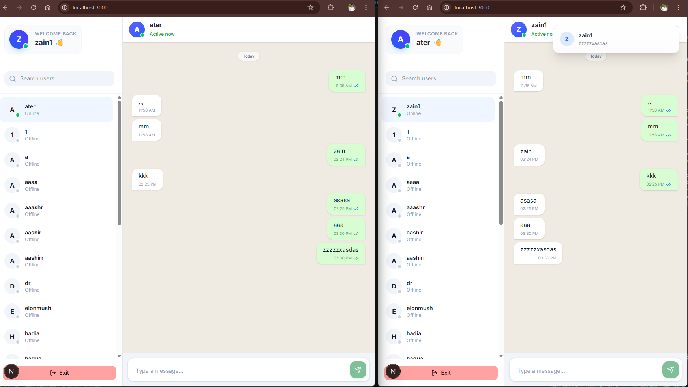

Images: 

src/
├── components/
│   ├── chat/
│   │   ├── ChatList.tsx      # Sidebar (User list & search)
│   │   ├── MessageArea.tsx   # The message feed
│   │   └── MessageInput.tsx  # Input field + Socket Emitters
├── hooks/
│   ├── useSocket.ts          # Core connection logic
│   └── useChatActions.ts     # Wrapper for send/receive logic
├── lib/
│   └── socket.ts             # Socket.io-client configuration
└── providers.tsx             # Context Provider for Global Socket State

🧑🏻‍💻Installation & Setup
         1-Clone & Install

                  Bash
                  git clone https://github.com/ZAINMUMTAZ999/nextjschatfrontend.git
                  npm install
         2 - Development Mode
                 npm run dev 

🚀 Cyberoid Real-Time Engine (Frontend)
       A High-Performance Next.js WebSocket Integration
       This frontend is designed to pair seamlessly with the Cyberoid Backend, focusing on low-latency updates, state synchronization, and a premium user experience.

🏗️ Architectural Decisions
1. Singleton Socket Management
       Instead of allowing multiple socket connections during React re-renders, I implemented a Singleton Pattern in lib/socket.ts.s

       Why: This prevents "socket leaking" and reduces server load by ensuring one client = one connection.

       Implementation: Managed via providers.tsx to provide a global socket instance across the App Router.

2. Hybrid Data Synchronization
        The application uses a dual-layer approach to data:

        Persistence Layer (REST): Uses TanStack Query to fetch historical messages from MongoDB. This allows for efficient caching and         "Infinite Scroll" pagination.

        Real-Time Layer (WebSockets): Handles high-frequency events (typing, online status, new messages) through the useChatActions.ts hook.

3. Optimized UI & Sound Logic
        To achieve a "Native App" feel, I implemented:

        Optimistic Updates: Messages appear instantly on the sender's screen before the server confirmation.

        Event-Driven Audio: A global listener in the SocketProvider monitors backend triggers to fire AudioContext notification sounds even if the user is in a different chat thread.